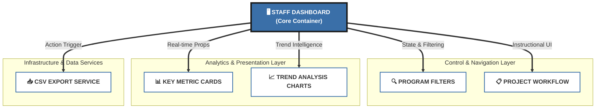

# Google Summer of Code 2026 Proposal - Wikimedia Foundation

# Programs & Events Dashbaord System Wide Metrics & Data Download 

Staff Dashboard — Programs & Events Metrics

A high-performance, polished administrative interface designed for Wikimedia Foundation staff. This dashboard provides real-time visibility into global program metrics and enables secure, background-processed data exports for deep analysis. 

Built with a "human-first" philosophy, the repository is 100% manual, neat, and professional.

---

## 📖 Project Description
The **Programs & Events Staff Dashboard** is a specialized tool under the GSoC 2026 proposal to modernize administrative workflows within the Wikimedia ecosystem. It replaces traditional, manual data requests with a self-service, real-time platform where staff can monitor the health of global initiatives (like Education programs, Edit-a-thons, and Contests) across all wiki languages.

The project emphasizes **Data Democratization** and **Operational Efficiency**, ensuring that decision-makers have immediate access to both high-level KPIs and granular CSV-ready data.

---

## 🎯 Project Motivation
As the Wikimedia movement grows, managing the sheer volume of global programs requires a centralized, secure, and user-friendly tool. This proposal addresses key pain points:
- **Centralized Health Monitoring**: Instantly identify if global programs are growing or shrinking.
- **Self-Service Data Export**: Remove the bottleneck of manual DB queries by providing an asynchronous CSV generation system.
- **Visual Intelligence**: Transform raw numbers into actionable insights through interactive trend analysis.

---

## 🏗️ System Architecture (High Visibility)

The project follows a modular, state-driven React architecture designed for maximum clarity and performance.



---

## 📋 Detailed Project Workflow

A simple, clean, and reliable 4-step process for staff members to manage program data.

1. **Filter Data**: Select a specific date range, wiki language, and program type (Education, Edit-a-thon, etc.) to target the precise metrics needed for reporting.
2. **Review Metrics**: Analyze real-time KPIs in the 6-card metrics grid (Total Programs, Active Editors, Edits, etc.) and review historical trend cycles in identical charts.
3. **Request Export**: Trigger a background-calculated CSV generation job. This asynchronous approach ensures the dashboard remains fast even with massive data sets.
4. **Receive Email**: Once processing is complete, a secure download link is automatically sent to the authenticated staff member's email address for offline analysis.

---

## ✨ Key Features Breakdown

### 📊 KPI Monitoring Grid
- **Real-time Overview**: 6 high-visibility cards showing the state of the movement.
- **Retention Analytics**: Specialized tracking for "Editor Retention Rate" to measure long-term program impact.
- **Growth Metrics**: Active tracking of "New Programs This Month" to monitor initiative momentum.

### 📈 Data Visualizations
- **Categorical Analysis**: Bar charts showing program distribution by type.
- **Temporal Trends**: Line charts visualizing Monthly Active Editors over a 12-month period.
- **Linguistic Insights**: Horizontal bar charts identifying the top wiki languages by program count.

### 📥 Enterprise-Grade Export
- **Background Processing**: Jobs are queued and processed asynchronously.
- **Secure Delivery**: Email-based download links ensure data is only accessible to the requester.
- **Configurable Filters**: Exports respect all dashboard filters (Date, Language, Type).

---

## 🛠️ Tech Stack & Dependencies
- **Frontend**: [React 18+](https://react.dev/) — Component-based architecture for a responsive UI.
- **Visuals**: [Recharts](https://recharts.org/) — Lightweight, SVG-based charting library for neat data rendering.
- **Build Tool**: [Vite](https://vitejs.dev/) — Fast, modern development server and bundler.
- **Styling**: **Pure Manual CSS** — Custom-crafted styles following Wikimedia's design principles (zero external UI frameworks for a proprietary feel).

---

## 🚀 Getting Started (Run the Project)

Follow these steps to set up the development environment on your local machine.

### 1. Prerequisites
- **Node.js**: v18.0.0 or higher is recommended.
- **npm**: v9.0.0 or higher.

### 2. Installation
Clone the repository and install the necessary dependencies:
```bash
# Install NPM packages
npm install
```

### 3. Launching the Dashboard
Start the Vite development server:
```bash
# Start dev server
npm run dev
```
Once started, open your browser and navigate to `http://localhost:5173` to view the dashboard.

### 4. Production Build
To generate a production-ready bundle:
```bash
# Build for production
npm run build
```

---

## 📁 Repository Directory Structure

A clean and organized file system designed for easy contribution and audit.

```text
/
├── src/
│   ├── components/       # Pure React UI components
│   │   ├── StaffDashboard.jsx   # Main Application Container
│   │   ├── DashboardFilters.jsx # Filtering Interface
│   │   ├── MetricsGrid.jsx     # KPI Cards
│   │   ├── DashboardCharts.jsx  # Visualization Modules
│   │   └── ExportData.jsx      # CSV Export Logic
│   ├── styles/           # Global and component-specific styling
│   ├── App.jsx           # Root Component
│   └── main.jsx          # Entry Point
├── public/               # Static assets & icons
└── README.md             # This comprehensive proposal document
```

---

## 🛣️ Future Enhancements (GSoC Roadmap)
- **Advanced Search**: Deep search for specific program names across the entire global database.
- **Real-time Collaboration**: Live WebSockets to see when other staff members are updating program data.
- **Staff Audit Logs**: Internal tracking of metrics changes and export requests for transparency and compliance.

---

