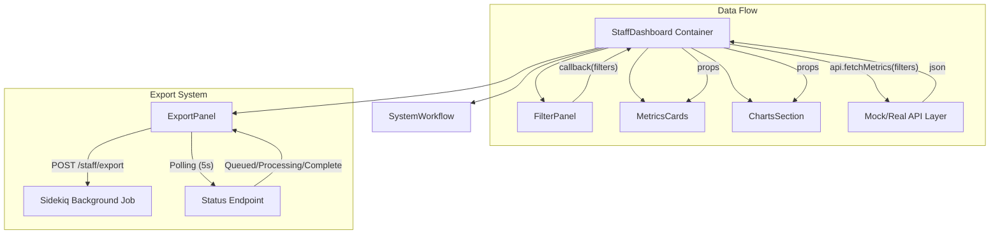

Google Summer of Code 2026 Proposal

# Programs & Events Dashboard — Staff Metrics and Data Export

This project is a React-based frontend module designed to be integrated into the [WikiEduDashboard](https://outreachdashboard.wmflabs.org/) (Wikimedia Foundation). It provides a secure, staff-only interface for monitoring system-wide metrics and exporting program data for offline analysis.

## 🏗️ Architecture Overview

The system follows a modular React architecture that prioritizes internationalization (i18n), responsive design, and robust background task handling.

## 🚀 Key Features

### 1. Data Intelligence & Filtering
- **Dynamic Filters**: Filter global data by Date Range, Wiki Language, and Program Type.
- **Instant Persistence**: Applying filters refreshes all 6 metric cards and 3 trend charts simultaneously.

### 2. Staff-Only Metrics
- **Six Key Performance Indicators (KPIs)**:
  - Total Programs, Monthly Active Editors, Total Edits, Articles Improved, New Programs, and Retention Rate.
- **Cache Management**: Displays a "Data cached" notice reflecting the 1-hour TTL logic of the backend.

### 3. Advanced Visualizations (Recharts)
- **Programs by Type**: Categorized bar chart (Education, Edit-a-thons, etc.).
- **Editor Trends**: Monthly time-series line chart.
- **Global Wiki Reach**: Horizontal bar chart of programs by language, utilizing specific WMF color branding.

### 4. Background Export Workflow
- **Sidekiq Integration**: Triggers a background job for heavy CSV generation to prevent UI locking.
- **Real-time Polling**: Recursive status tracking (Queued → Processing → Email delivery) with visual success/failure indicators.

## 🛠️ Technical Stack
- **Framework**: React 18+ (Functional Components & Hooks only)
- **State Management**: React `useState` & `useCallback` for optimized re-rendering.
- **Visualization**: [Recharts](https://recharts.org/) for responsive, accessible data plotting.
- **Styling**: Vanilla CSS (Wikipedia-inspired "Human" minimal design).
- **Internationalization**: Custom `i18n.js` with `t()` helper for 100% translatable UI.

## 📦 Project Structure
- `src/components/`: Modular React components.
- `src/styles/`: Shared CSS matching WikiEduDashboard conventions.
- `src/mockApi.js`: Simulated backend for standalone verification.
- `src/i18n.js`: Centralized string management.

## ⚙️ Setup & Development
1. **Install dependencies**: `npm install`
2. **Start Dev Server**: `npm run dev`
3. **Build Core**: `npm run build`

---
*Created as part of the GSoC 2026 Proposal for Wikimedia Foundation.*
