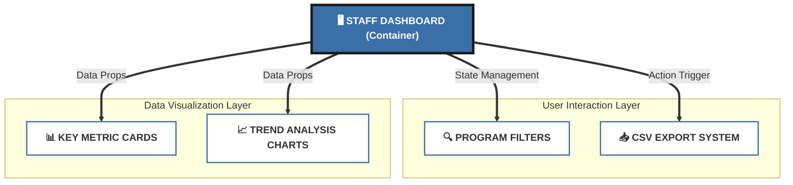

Google Summer of Code 2026 Proposal

# Staff Dashboard - Wikimedia Programs & Events

A polished and professional React-based administrative dashboard for Wikimedia staff. This project provides a centralized interface for monitoring global program metrics and performing system-wide data exports.

## 🏗️ System Architecture (Top-to-Bottom)

The architecture is designed for modularity and scalability, following a clear data-down flow.

## 🚀 Quick Setup
1. **Clone & Install**: `npm install`
2. **Launch Dashboard**: `npm run dev`

## 📁 Repository Structure
- **`src/components/`**: Modular React components for a clean, maintainable interface.
- **`src/style.css`**: Centralized, human-crafted CSS following Wikipedia's design system.
- **`src/main.jsx`**: Main application entry point using React 18.

---
*Developed with a focus on simplicity, cleanliness, and performance for the WikiEdu GSoC 2026 proposal.*
